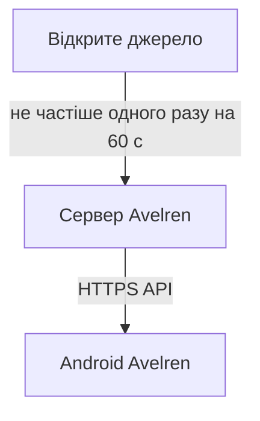
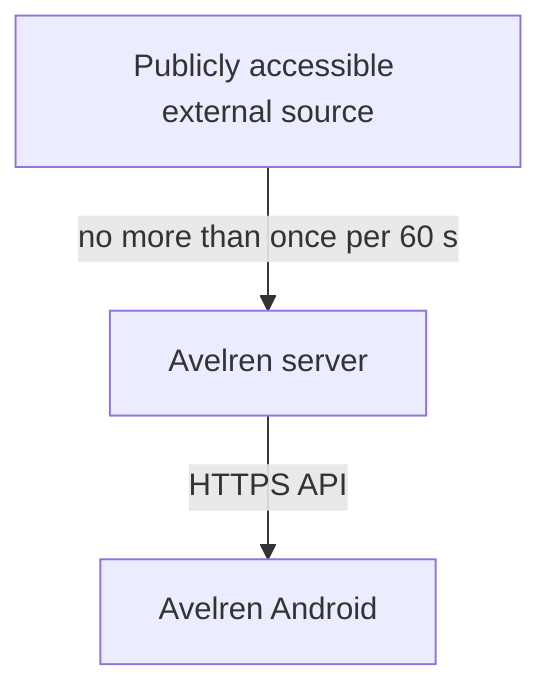

# Avelren

## Українська

Avelren — незалежний неофіційний Android-продукт для спостереження за поточним навантаженням. Сервер отримує дані з відкритого джерела, нормалізує їх і віддає Android-клієнту через власний API. Телефон ніколи не звертається до відкритого джерела напряму.

Проєкт перебуває на ранньому етапі. Поточний репозиторій задає безпечний каркас, API-контракт і правила розробки; він не є production-сервісом.

### Архітектура



Основні інваріанти:

- Android взаємодіє лише із сервером Avelren.
- Інтервал опитування відкритого джерела не може бути меншим за 60 секунд, навіть через помилкову конфігурацію.
- Одночасно дозволений лише один запит колектора.
- API має явний стан свіжості `fresh`, `stale` або `unknown`.
- Базовий крок порога — 50. При зростанні значення сервер визначає всі нові кратні 50 пороги.

Наприклад, перехід із `40` до `160` перетинає пороги `50`, `100` і `150`. Перший успішний знімок формує базову точку та не створює подію.

### Перший етап

До першого етапу входять:

- документований API-контракт;
- серверна модель поточного знімка;
- безпечне опитування з мінімальним інтервалом 60 секунд;
- обчислення порогів із кроком 50;
- Android-каркас, підготовлений для роботи лише з API Avelren;
- локальні та контрактні приклади для розробки.

До першого етапу **не входять**:

- Firebase Cloud Messaging (FCM);
- гарантовані фонові сповіщення;
- production collector та production deployment;
- облікові записи користувачів або зберігання персональних даних.

Андроїд-модуль підключено до API-клієнта Avelren для завантаження поточного навантаження. Локальні сповіщення та надійна фонова доставка залишаються окремими наступними кроками.

### Структура репозиторію

```text
avelren/
├── apps/                  # Клієнтські застосунки
├── services/              # Серверні компоненти
├── contracts/             # OpenAPI та приклади відповідей
├── docs/                  # Архітектура і модель загроз
└── .github/               # Шаблони та перевірки політик
```

### Документація

- [Архітектура](docs/architecture.md)
- [Модель загроз](docs/threat-model.md)
- [API-контракт](contracts/openapi.yaml)
- [Правила внесків](CONTRIBUTING.md)
- [Політика безпеки](SECURITY.md)

### Конфігурація

Використовуйте `.env.example` як шаблон локальних змінних середовища. Автоматичне завантаження `.env` ще не підключене. Реальні адреси, ключі та production-конфігурація не мають потрапляти до Git.

Сервер відхиляє значення, менші за безпечну межу:

```text
POLL_INTERVAL_SECONDS >= 60
```

### Локальний запуск API

```bash
cd services/api
npm ci
npm test
npm run dev
```

Демонстраційні endpoints: `GET /v1/health` і `GET /v1/workload`.

Android-проєкт розміщений у `apps/android` і використовує Gradle wrapper 9.4.1. За замовчуванням він має неробочу HTTPS-адресу API; реальну адресу задають локально через `AVELREN_API_BASE_URL`.

### Коміти та pull request

Заголовок кожного коміту та pull request:

```text
type(scope): Українська назва / English title
```

Тіло завжди містить український блок першим:

```text
UA:
Опис зміни українською.

EN:
Change description in English.
```

Детальні правила та дозволені типи наведені в [CONTRIBUTING.md](CONTRIBUTING.md).

### Безпека та статус

Avelren не є офіційним сервісом. Дані можуть бути неповними, застарілими або тимчасово недоступними. Не використовуйте їх як єдину підставу для критичних рішень.

Ліцензійну модель ще не визначено. Файл `LICENSE` свідомо не додається на цьому етапі.

---

## English

Avelren is an independent, unofficial Android product for observing current workload. The server obtains data from a publicly accessible external source, normalizes it, and serves it to the Android client through its own API. The phone never contacts the publicly accessible external source directly.

The project is at an early stage. This repository currently defines a secure foundation, an API contract, and contribution rules; it is not a production service.

### Architecture



Core invariants:

- Android communicates only with the Avelren server.
- The polling interval for the publicly accessible external source cannot be lower than 60 seconds, even through invalid configuration.
- Only one collector request may be in flight at a time.
- The API exposes freshness explicitly as `fresh`, `stale`, or `unknown`.
- The baseline threshold step is 50. When the value increases, the server identifies every newly crossed multiple of 50.

For example, a transition from `40` to `160` crosses `50`, `100`, and `150`. The first successful snapshot establishes the baseline and does not create an event.

### First milestone

The first milestone includes:

- a documented API contract;
- a server-side current snapshot model;
- safe polling with a minimum interval of 60 seconds;
- threshold calculation with a step of 50;
- an Android scaffold prepared to work only with the Avelren API;
- local and contract examples for development.

The first milestone **does not include**:

- Firebase Cloud Messaging (FCM);
- guaranteed background notifications;
- a production collector or production deployment;
- user accounts or storage of personal data.

The Android module is now connected to the Avelren API client for workload loading. Local notifications and reliable background delivery remain separate next steps.

### Repository layout

```text
avelren/
├── apps/                  # Client applications
├── services/              # Server components
├── contracts/             # OpenAPI and response examples
├── docs/                  # Architecture and threat model
└── .github/               # Templates and policy checks
```

### Documentation

- [Architecture](docs/architecture.md)
- [Threat model](docs/threat-model.md)
- [API contract](contracts/openapi.yaml)
- [Contribution guide](CONTRIBUTING.md)
- [Security policy](SECURITY.md)
- [Production deployment](docs/deployment.md)

### Configuration

Use `.env.example` as a template for local environment variables. Automatic `.env` loading is not wired yet. Real addresses, credentials, and production configuration must never be committed to Git.

The server rejects values below the safe boundary:

```text
POLL_INTERVAL_SECONDS >= 60
```

### Run the API locally

```bash
cd services/api
npm ci
npm test
npm run dev
```

Demo endpoints: `GET /v1/health` and `GET /v1/workload`.

The Android project lives in `apps/android` and uses the Gradle 9.4.1 wrapper. Its default API URL is a non-working HTTPS address; set the real server URL locally through `AVELREN_API_BASE_URL`.

### Commits and pull requests

Every commit and pull request title must follow:

```text
type(scope): Українська назва / English title
```

The body always places the Ukrainian block first:

```text
UA:
Опис зміни українською.

EN:
Change description in English.
```

See [CONTRIBUTING.md](CONTRIBUTING.md) for the full rules and allowed types.

### Security and status

Avelren is not an official service. Data may be incomplete, stale, or temporarily unavailable. Do not use it as the sole basis for critical decisions.

The licensing model has not been selected yet. A `LICENSE` file is intentionally not included at this stage.
