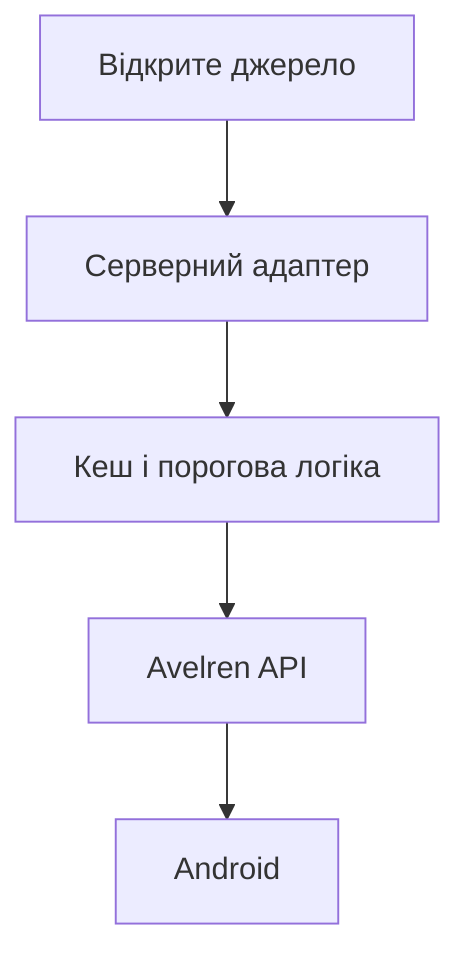
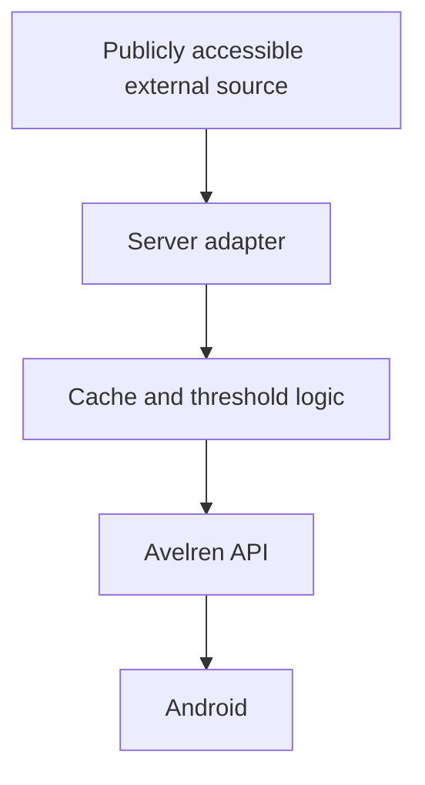

# Архітектура Avelren / Avelren Architecture

## Українська

### Межа системи

Avelren відокремлює Android-клієнт від відкритого джерела. Лише серверний адаптер матиме право отримувати зовнішні дані. Android працює винятково з HTTPS API Avelren і не зберігає серверних секретів.

Запит Android ніколи не запускає синхронний запит до відкритого джерела. API повертає лише стан, який уже є на сервері, тому кількість телефонів не впливає на частоту зовнішнього опитування.

### Що реалізовано в каркасі

| Компонент | Поточний стан |
|---|---|
| `GET /v1/health` | Реалізовано й протестовано |
| `GET /v1/workload` | Реалізовано з in-memory demo provider |
| `PollingCoordinator` | Ін’єктований `SourceClient`, single-flight, мінімум `60_000 ms` |
| `ThresholdPolicy` | Базова точка та всі перетнуті пороги з кроком 50 |
| Android | Compose placeholder, demo repository, модель контракту API |
| Production adapter | Не реалізовано; реальної адреси або селекторів у Git немає |
| Push-доставка | Не реалізовано |

### Інваріант опитування

`PollingCoordinator` відхиляє нецілий інтервал або значення менше `60_000 ms`. Перший цикл запускається один раз, наступний планується лише після завершення попереднього, тому паралельних запитів у межах процесу немає.

У production перед підключенням адаптера також потрібні:

- timeout і обмеження розміру відповіді;
- backoff із дотриманням `Retry-After`;
- збереження часу останньої спроби або lease, щоб рестарт чи кілька реплік не порушили межу 60 секунд;
- перевірка схеми та відмова за замовчуванням.

### Контракт стану

`GET /v1/workload` повертає:

| Поле | Значення |
|---|---|
| `locationId` | Серверний ідентифікатор точки |
| `vehicleCount` | Невід’ємне ціле, максимум `1_000_000` |
| `observedAt` | Час, якому відповідають дані |
| `receivedAt` | Час прийняття сервером |
| `freshness` | `fresh`, `stale` або `unknown` |
| `sequence` | Монотонний номер серверного стану |

Повний контракт: [`contracts/openapi.yaml`](../contracts/openapi.yaml).

### Порогова політика

Перший валідний результат формує базу без події. При зростанні політика повертає кожне кратне 50 значення в інтервалі `(previous, current]`. Наприклад, `40 → 160` дає `50`, `100`, `150`; зменшення або незмінне значення не дає подій.

Зараз це чистий протестований серверний модуль. Наступні кроки — прив’язати його до нормалізованих знімків, додати ідемпотентне сховище подій і лише потім FCM.

## English

### System boundary

Avelren separates the Android client from a publicly accessible external source. Only a server-side adapter may obtain external data. Android communicates exclusively with the Avelren HTTPS API and stores no server secrets.

An Android request never starts a synchronous source request. The API serves only state already held by the server, so the number of phones cannot amplify external polling.

### Implemented scaffold

| Component | Current state |
|---|---|
| `GET /v1/health` | Implemented and tested |
| `GET /v1/workload` | Implemented with an in-memory demo provider |
| `PollingCoordinator` | Injected `SourceClient`, single-flight, minimum `60,000 ms` |
| `ThresholdPolicy` | Baseline plus every crossed threshold in steps of 50 |
| Android | Compose placeholder, demo repository, API contract model |
| Production adapter | Not implemented; Git contains no real address or selectors |
| Push delivery | Not implemented |

### Polling invariant

`PollingCoordinator` rejects non-integer intervals and values below `60,000 ms`. It starts one initial cycle and schedules the next only after the previous cycle finishes, preventing overlap inside one process.

Before connecting a production adapter, also add:

- a timeout and response-size limit;
- backoff that respects `Retry-After`;
- a durable last-attempt timestamp or lease so restarts and multiple replicas cannot break the 60-second boundary;
- schema validation with fail-closed behavior.

### State contract

`GET /v1/workload` returns:

| Field | Meaning |
|---|---|
| `locationId` | Server-owned location identifier |
| `vehicleCount` | Non-negative integer, maximum `1,000,000` |
| `observedAt` | Time represented by the data |
| `receivedAt` | Server receipt time |
| `freshness` | `fresh`, `stale`, or `unknown` |
| `sequence` | Monotonic server-state sequence |

The complete contract is in [`contracts/openapi.yaml`](../contracts/openapi.yaml).

### Threshold policy

The first valid result establishes a baseline without an event. On an increase, the policy returns every multiple of 50 in `(previous, current]`. For example, `40 → 160` yields `50`, `100`, and `150`; a decrease or unchanged value yields no events.

This is currently a pure, tested server module. The next steps are to connect it to normalized snapshots, add an idempotent event store, and only then add FCM.
